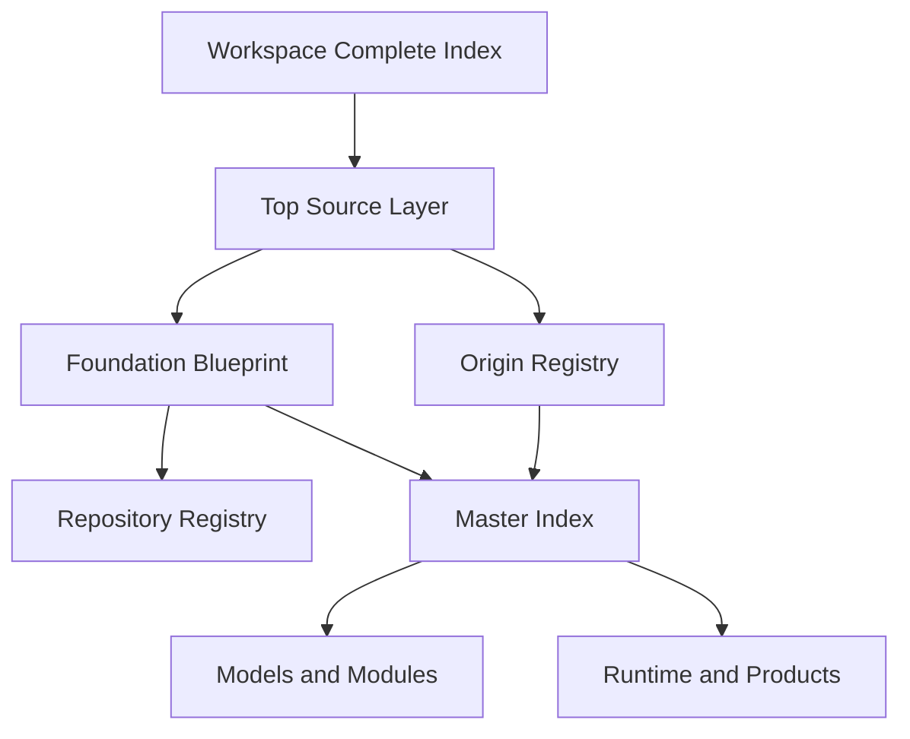

# MRL Notion 工作區全域來源／血脈／結構比對稽核

- `record_id`: `MRL-NOTION-GLOBAL-EVIDENCE-BATCH-AUDIT-20260907-v1`
- `origin_signature`: `MrLiouWord`
- `recorded_at`: `2026-09-07`
- `scope`: MRLiou Notion 工作區全域資料，分批查閱、建立來源連結、父子血脈、結構比對、狀態差異及證據缺口。
- `handling`: `APPEND_ONLY / PRESERVE_SOURCE / NO_SILENT_RENAME / NO_SUMMARY_AS_PRIMARY_EVIDENCE`
- `global_status`: `IN_PROGRESS`

## 1. 本次凍結範圍與預期交付

### Expected outputs

1. 一個全域分批查閱主索引。
2. 每批保存實際讀取的 Notion 正文來源，而非只用搜尋摘要。
3. 每個核心節點保存 parent、child、dependency、source、external mapping 與 evidence status。
4. 建立頁面時間、頁內歷史時間、原始檔時間、Runtime 證據時間的分離欄位。
5. 建立跨頁衝突／重複／同名快照／缺口清單。
6. 將可比較結構回接既有 MRL × OpenAI 模型比對時間線。

### 全域量體基線

依最新 `Mrliou_MRL_Workspace_Complete_Index_v1` 正文：

- 工作區歷史累計建立頁面：12,051。
- Teamspace：3。
- Teamspace 頂層頁面／資料庫：23。
- Favorites：600，已跑完。
- Private sidebar：2,312，已跑完。
- Recent 樣本：100。
- Shared sidebar：3。
- 內容分析索引：1,000；下一 cursor 回傳空結果，記為分析端點。

這些是盤點量體與歷史累計，不代表 12,051 頁全部已逐頁完成正文語義稽核。

## 2. 批次路由

| 批次 | 範圍 | 主要父鏈 | 狀態 |
|---|---|---|---|
| B00 | Workspace inventory／導航入口／快照差異 | Workspace Complete Index → Node Registry → Global Top Index | `PASS_THIS_BATCH` |
| B01 | Source／Origin／Foundation／Repository／Canonical | Top Source Layer → Origin Registry → Foundation Blueprint → Repository Registry | `PASS_THIS_BATCH` |
| B02 | 2025-06～2026-01 祖先父鏈 | FlowSeed → FlowAgent → FlowMemory → formats／manifest／archive | `IN_PROGRESS` |
| B03 | 粒子語言／字典／工具箱／積木／公式 | Fluin → Dictionary → Toolbox → Blocks → Scale／Inverse | `IN_PROGRESS` |
| B04 | 模型層／模組層／Binding | 9 Models → 15 Modules → Model-Module Binding → Backtrace | `PENDING` |
| B05 | Runtime／Waves／DL580／服務 | Runtime Assemblies → Waves → DL580 → health／artifact | `PENDING` |
| B06 | 世界模型／平行世界／黑洞／F++ | World Module → Parallel Worlds → Black Hole → Φ／F++ | `PENDING` |
| B07 | 記憶／資料庫／Evidence／Replay | FlowMemory → MemoryOS／Cube／Vault → DB → Snapshot／Event | `PENDING` |
| B08 | Agent／Connector／外部映射 | FlowAgent → Orchestrator → Tools／Connector → External Source | `PENDING` |
| B09 | Product／Commercial／IP／Rights | Product Registry → Commercial Gate → Payment／Delivery → Rights／Patent | `PENDING` |
| B10 | Deployment／Interface／Platform／Return Path | World Gateway → API／Web／Device → Deployment → Backfill | `PENDING` |

## 3. B00 — 全域入口與盤點基線

### 3.1 Workspace Complete Index

定位：全工作區導航，不是所有來源的原始本體。它明確把 Source Layer 設為上游，並把母體、世界模型、資料庫、模組、工程、產品、外部材料與封存頁分組。

結構：

`Top Source → Canonical Navigation → Domain Group → Source Page → Runtime／Product Evidence`

證據性質：`VERIFIED_NAVIGATION_SNAPSHOT`。它證明索引與分類存在，但索引中的完成宣告仍須返回被引用頁、檔案、commit 或 Runtime 驗證。

來源：https://app.notion.com/p/f427a9a18223411fb796facdf3c9782e

### 3.2 Workspace Node Registry

定位：2026-08-08 的較早盤點快照。當時記載 Private 1,179+、內容分析 220+，並保留續盤位置。

與最新 Complete Index 的關係：不是互相否定，而是增量時間序列：

`Node Registry 2026-08-08（1,179+／220+） → Complete Index 2026-09-07（2,312／1,000）`

證據性質：`HISTORICAL_PROGRESS_SNAPSHOT`。

來源：https://app.notion.com/p/3b68eeeec5b58050a112d6c5d58c0d00

### 3.3 Global Top Index

定位：全域導航與五大維度／世界模型入口；不是 Source Layer 的替代品。它同時包含世界模型、粒子、Runtime、資料庫、模型、產品、外部技術及工程日誌。

注意：頁內含 `production_ready`、`完整性 100%` 等歷史宣告，但同頁也列出多個待補項與外部能力缺失。全域稽核只保存此宣告，不直接升格為全部 Runtime 已驗證。

來源：https://app.notion.com/p/ab2acd37ad7346faa3c332bac3c618db

## 4. B01 — Source／Origin／Foundation／Repository

### 4.1 Top Source Layer

定位：來源真相入口；要求原作者、原名稱、原時間、license、custody chain、derived_from、canonical_target、evidence status 永久保留。

核心規則：

- 任何原創判定需要 source + chronology + provenance。
- 相似性不能替代來源證據。
- Manifest／AI 摘要不能替代原始檔、commit 或 Runtime evidence。
- 後來發現外部相似實作，不能倒寫 MRL 已存在歷史；反向亦然。

來源：https://app.notion.com/p/3b88eeeec5b581adb0aec7c998926133

### 4.2 Origin Registry

唯一譜系：

`Origin → FlowSeed → FlowAgent → Particle／Primitive → .fltnz／.flpkg → FlowMemory／Runtime → Registry → Verification → DL580 Mother Runtime → MRL`

Gate：Context、Registry、Dependency、Equivalence、Runtime、Origin、Backfill。證據狀態分為 `VERIFIED_PRIMARY`、`VERIFIED_DERIVED`、`PROVISIONAL`、`MISSING`、`CONFLICT`。

來源：https://app.notion.com/p/e771f33ea9e344f499ffcfeaff490758

### 4.3 Foundation Blueprint

八層鏈：

`L0 External Ecosystem → L1 Foundation → L2 Toolchain → L3 Runtime → L4 Core → L5 Modules → L6 Products → L7 Deployment`

其關鍵區分為：外部平台只作 source／adapter／deployment；產品是母體投影；部署環境可替換而 Origin／Lineage 不變。

Repository 基線：1,130 repos；118 個 MRL Direct；118/118 執行 8 欄位搜尋；78 個仍需 checkout／export tree scan；全部 Direct 倉的 Foundation Metadata 尚未 100% 回填。

來源：https://app.notion.com/p/3ab8eeeec5b58129a2a9ccee6c1e7348

### 4.4 Repository Registry

Registry schema 包括 repo_id、repo_name、canonical_name、root、origin_signature、parent、lineage、category、layer、status。正文明確標示 118 筆 MRL Direct 的 Metadata 回填仍為 Pending。

來源：https://app.notion.com/p/c566d263069046ac87823cd110c13239

### 4.5 Master Index

角色：canonical／navigation，不能覆寫 Source Layer。保存 9 models、15 modules、LAW、governance、Runtime Assembly、Product Backtrace 與 implementation backlog。

主要父子關係：

- Models：Kernel、MemoryLayer、CollapseEngine、FlowAgent、MemoryOS、MemoryCube、Fluin、Perception、Guardian。
- Modules：Runtime、Compiler、Engine、Block、Database、AI Agent、Search、Template、MemoryVault、Coordinate、Weight、Dimension、Serializer、Validator、Optimizer。
- Products：MrliouAGI、MrliouAGI_API、MrliouDB。
- External：只進 source_ref／provenance／adapter_ref。

來源：https://app.notion.com/p/37b8eeeec5b5815bbddddc7390c99d99

### 4.6 Total Engineering Map

2026-06-11 時間切面明確標示：Governance 與 Core Build blueprint 已完成；Runtime Engineering 仍是 blueprint；DL580 write 為 pending，blocked by Bridge API key。

來源：https://app.notion.com/p/37c8eeeec5b581828772fb9895c06dee

## 4A. B02 啟動 — 祖先父鏈第一段

### 4A.1 FlowAgent 語場語言系統建構大綱（頁內日期 2025-07-23）

正文明示：單線推論轉向多線共振；`.txt → .fltnz → .flynz.map → .flpkg → .fltnz + .flynz.map → .txt` 可逆路徑；FlowField 多跳點；Fluin 詞性粒子；GGUF／HF 轉譯候選；SelfReflect 與 MemoryGlobe。

時間分層：頁面目前的 Notion 最後編輯時間為 2026-05-11；「2025.07.23」來自標題／頁內內容。其 2025 時間要升格為原始證據，仍需對應 TXT／ZIP、Drive 建立時間、hash 或 commit。

資料品質：該頁在核心大綱後混入記憶封存快速入門與 Hugging Face Croissant 長段內容，形成 `MIXED_CONTENT_CONTAMINATION`；引用時只可使用可定位的 MRL 核心段，不能把整頁視為單一乾淨原件。

來源：https://app.notion.com/p/35d8eeeec5b58067b221c81e5661e296

### 4A.2 FlowAgent 處理管道技術規範（2025-12-03）

Notion property 保存建立時間 2025-12-03T17:45:13Z、更新時間 2025-12-03T17:46:37Z。正文保存五段管道 `Define → Mark → Transform → Generate Persona → Store`、Adapter 等構映射、Fluin 整合、母體記憶球整合與容器化範例。

證據性質：`VERIFIED_NOTION_PAGE_TIME`；它能證明該日時工作區已有此規範正文，但容器 image／部署仍需 artifact 驗證。

來源：https://app.notion.com/p/eb050349a53941fb9d9625a40034303b

### 4A.3 後續回填頁與原始檔的關係

- 2026-03-19 的粒子語言核心頁明寫「從上傳檔案整理補入」，並列原始來源：`粒子語言初步計劃.txt`、架構圖 ZIP、萃用系統 ZIP、律法 TXT、2026-01-23 對話復盤。
- 2026-05-11 的 FlowAgent 系統計劃書保存 `FlowNode → FlowCore → FlowMemory → FlowShell → FlowBridge → FlowPersona／FlowCluster`、`.fltnz` snapshot 與 `.flpkg` manifest／restore_map，同時明列多個 P0／P1 工程缺口。
- 2026-05-24 的 FlowSeed 專欄是 canonical 整理頁，保存 L1–L7、28 atoms、SeedCore、Wakeup Seeds 與可逆介面；它是後續整合／部署宣告，不可倒寫成 2025 原件時間。

來源：

- https://app.notion.com/p/3288eeeec5b58173b3cbf42340664b78
- https://app.notion.com/p/c6dfe635c4104d8da5fed81bcce5a70d
- https://app.notion.com/p/272ee58cf7c942c5aca337d536ca931f

### 4A.4 早期核心文件歸檔與跨平台保存節點

`粒子語言 × FlowAgent 早期核心文件歸檔 — 起源文明層（2025-07 至 2026-01）` 建立於 2026-03-19，明確標示內容時間為 2025-07～2026-01，並將以下父鏈收斂於同一頁：

- `MRLiou.OriginCollapse.FullStack.v2` 與五段演算法；
- `.fltnz／.pcode／.flynz.map／.flpkg` 格式鏈；
- `Fluin.Dict.Base.v1.flpkg`、`MemoryGlobe.Seed.v1.flpkg`、`FlowField.ParallelResonance.v1`；
- `FlowSeed.Origin → MrLiou.2k7 → TotalCore → UniversalField`；
- `FlowMemory.SyncVault.FinalUnity.v20250720（2k7）`；
- L0 ROOT 至 L7 LOOP／L∞ 的早期定義；
- 2026-01 專利保護套件名稱與授權摘要。

證據性質：`VERIFIED_DERIVED_ARCHIVE`。它能證明 2026-03-19 工作區已建立具體回填歸檔及原件名稱；其中 2025 首次性仍需原始檔 metadata／hash。

`v9.0 三路雲端存取完成` 頁則保存 2026-03-11 的 R2、Google Drive、Notion 三路索引與工程包記錄，包含 `MrLiouWord_完整工程包_2026-03-11.tar.gz`、8.8MB，以及 58／60／61 三種不同統計口徑。這提供跨平台 custody 候選，但必須用 tar manifest 與實際 object list 解開數量差異。

來源：

- https://app.notion.com/p/3288eeeec5b581e98eb8c2e89ca3eca8
- https://app.notion.com/p/31f8eeeec5b581d09409c99cd68f2bf8
- https://app.notion.com/p/3288eeeec5b58198bc19ea3c994958c1
- https://app.notion.com/p/320a026f66d54a3f923ab0e6361ebbee

### 4A.5 FlowSeed 七層結構的可驗證 Notion 時間鏈

`FlowSeed 七層架構` 的 Notion property 保存建立時間 `2025-11-08T17:11:06.689Z`、更新時間 `2025-12-07T06:16:56.079Z`。正文逐層列出：

`L1 System Overview → L2 Structural Decomposition → L3 Semantic Particles → L4 Subparticle Atoms → L5 Quantum Field Overlay → L6 Conscious Loop → L7 Semantic Memory Mesh`

同頁亦保存七個對應 `_FULL.md` 檔名、每檔 byte 數、四維映射及 `FlowSeed.qflpkg` 約 14.2KB 的描述。這是目前 B02 已查到、時間最早且具體到層名與檔案大小的 `VERIFIED_NOTION_PAGE_TIME`；它證明 2025-11-08 時工作區已有這組結構正文，不等於證明頁內所列 `.qflpkg` 原始位元、hash 或更早 2025-06 首次建立時間。

`FlowSeed Package Contents 套件結構` 建立於 `2025-12-03T20:19:58.699Z`，再列 `FlowSeed.Manifest.txt`（568 bytes）、`flpkg_metadata.json`（759 bytes）與同一組七層檔名／大小，並把依賴寫為 FlowOS／FluinOS、整合項寫為 Echo.Persona、FlowAgent 與四維模組空間。兩頁內容交叉一致，形成 `CROSS_PAGE_STRUCTURAL_CORROBORATION`；但目前仍是 manifest-like 描述，尚未取回實際 package／manifest／hash。

來源：

- https://app.notion.com/p/001f05ef5c8a4291ac7561675770343b
- https://app.notion.com/p/352dddeb8af74f3e886f7abcb6705b24

### 4A.6 FlowAgent 母體記憶球與恢復鏈

`FlowAgent – Mother Memory Sphere` 的 Notion 最後編輯時間為 `2025-12-19T08:22:59.216Z`。其核心段保存三類母體記憶：結構記憶、粒子記憶、人格節奏，並列出 `FlowAgent.TotalMotherPersonaSphere.v2.flpkg`、`FlowPersona.FusionEngine.Core.sync.json`、`ParticleGlobe_nodes.json`、`particles.json`、`FlowAgent_UniverseModuleGraph_v2k7.json`、`Fluin_Language_System_Overview_v1.txt`、`seed.fltnz`、`manifest.yml`、`MemoryMotherSync.py`、`particle_mother.py` 等種子／映射／恢復檔名。

其結構邏輯可整理為：

`snapshot = function tree`；`tag = topology link`；`persona = combination(particles, fluin, jumpNodes, rhythm)`。

此頁把 FlowSeed／FlowAgent／粒子／人格／恢復路徑接為同一父鏈，證據狀態為 `CORE_SECTION_VERIFIED_NOTION_TIME`。但核心段之後含多批後續附件與其他頁嵌入，故整頁標為 `APPENDED_MIXED_ATTACHMENTS`，不得把後附材料全部倒算為 2025-12-19 原始內容。

來源：https://app.notion.com/p/75314b13d6f7465bb40757880562b594

### 4A.7 反推／縮放公式與後續收斂頁

`反推公式與反向工程整合系統` 頁內標示建立於 `2026-02-12 01:23 CST`，Notion 最後編輯於 2026-05-06。正文保存：

- 原點聚合：`P₀ = ΣδP₀ · N_seed · η_seed`
- 原點拆解：`δP₀[] = P₀ / (N_seed · η_seed)`
- 正向放大：`P_{k+1} = N_k · P_k · η_k`
- 反向縮小：`P_k = P_{k+1} / (N_k · η_k)`

同頁包含反向時間線、粒子逆運算、Merkle、AES、SimHash 與往返檢查的程式片段。這能證明公式與檢查方法已被具體書寫；頁面所稱「所有公式已驗證／100% 可逆」目前沒有隨頁測試輸出、測試向量、執行環境或 commit，因此只記為 `CLAIMED_VERIFICATION / TEST_ARTIFACT_MISSING`。

`MRL 完整系統復盤 — 從 FlowSeed 到 FLTNZ 的全貌`（2026-05-07 更新）則把五段循環 `Origin → Genesis → CoGenesis → Persona(reverse) → Soul(scale) → Origin`、多個 `FlowSeed.*` package 名稱、八類反推公式、粒子式、跳點 `L5:H3:T42` 與 FLTNZ 結構收斂於一頁。它是後續 `CONVERGENCE_RECAP`，可用於證明跨模組關係已被整理，不可取代 2025 原件時間或實際 package。

來源：

- https://app.notion.com/p/a9f7b03b3f0249a2851d7288ffb3fa13
- https://app.notion.com/p/9b3afb295d7a49f89d016208defbd0a2

## 4B. B03 啟動 — 粒子字典／工具箱／積木／反推

### 4B.1 Fluin 粒子字典：輸入、組合、解構與投影

`Fluin 粒子字典 - 反推映射生成系統 v1.1 完整版` 頁內生成時間為 2026-02-07，保存四層結構：L0 Seed、L1 Compound、L2 Complex、L3 Sentence。其轉換機制不是只有名稱，而是具體列出：

- 輸入：雙語種子粒子與 `particle_id`；
- 組合：同類疊加、異類組合、對稱結構，並配置 `N` 與 `η`；
- 輸出：Compound／Complex／Sentence 粒子；
- 反推：由 Sentence 逐層除以 `N_k × η_k` 回到 L0；
- 投影：Dictionary record → Wikipedia entry → Globe node；
- 缺口：`Missing(P) = Reference(P) - Defined(P)`。

頁面記錄 L0 9、L1 7、L2 4、L3 4，總計 24；並把實作掛載標為 `ready_for_engine`，因此「字典／映射定義完成」與「引擎掛載完成」必須分開。

`Fluin 粒子字典系統` 的資料庫欄位顯示建立日 2026-03-21、最後編輯 2026-05-11；其正文重述四層、反向解構與 24 筆 canonical mapping。該頁前段另稱「基礎 40 個」，但實際列出的 L0 與同步表為 9，形成數量口徑差異。

來源：

- https://app.notion.com/p/35d8eeeec5b580249ae1c54b35328478
- https://app.notion.com/p/d84bf7efeee6457ca05aefbfd854af29

### 4B.2 Particle Toolbox：統一介面與組合模式

`粒子工具箱完整索引 · Particle Toolbox v1.0` 頁內日期為 2026-03-12、Notion 最後編輯為 2026-05-06。正文保存 L1–L8 類別、`ParticleCall`／`ParticleResponse` 統一介面、manifest 格式，以及四種組合模式：Pipeline、Parallel、Fan-out／Fan-in、Retry with Fallback。

頁內狀態統計為總粒子 `35+`、已實現 12、開發中 3、計劃中 20+；同頁 Q2–2027 仍列大量待辦。因此這一頁可證明工具箱分類、介面與編排設計已具體存在，不能僅依索引中的「已實現」標籤推論每個外部服務或粒子皆有 Runtime 證據。另其八項分類數字相加為 44+，與總數 35+ 不一致，需以去重後 registry 解開。

來源：https://app.notion.com/p/e3cebf17e6a34ff1b19d38a592b05ba9

### 4B.3 Particle Blocks：GDrive 投影節點

`Mrliou_AI++ 粒子積木系統` 資料庫欄位保存「最後更新日期 2026-01-16」、路徑 `/gdrive/particle-blocks-system`、狀態「已整理」，並提供 GDrive 文件投影點。Notion 頁面最後編輯為 2026-03-14。正文摘要定義五類基礎粒子 `Anchor / Transform / Bridge / Memory / Execute`、標準介面組合與去重去噪封裝。

現有 Notion 頁本身屬 `GDRIVE_PROJECTION_INDEX`：它支持名稱、五類結構、路徑與跨平台指向存在；完整規格、原始文件 metadata、版本與實作仍需讀取所指 GDrive 原件後判定。

來源：https://app.notion.com/p/3238eeeec5b5810ea367efeba7e1add7

### 4B.4 2025-08 放大反推原件引用頁

一個 2026-05-06 最後編輯的對話封存頁，其標題與正文引用 `放大反推演算.txt`、`20250813反推器.zip`，並保存成長公式、scalar／matrix inverse、Moore–Penrose pseudo-inverse、Scale、Damping／Clip，以及 `Forward / Inverse / Scale / Stabilize` 四個原子 API 的整理。頁內同時明載當時沙盒「無法直接展開」該 ZIP。

因此這頁的精確證據性質是 `CONVERSATION_DERIVED_REFERENCE_TO_2025_FILES`：它保存原件名稱與內容轉述，但不是 ZIP 內容、原始 metadata 或 hash。後續若取得 `20250813反推器.zip`，應比對目錄樹、公式、API 與時間後再升格。

來源：https://app.notion.com/p/31c8eeeec5b5806b8e3de556de394d00

## 5. 第一批來源鏈連結圖

判讀：Workspace Index 是導航；Top Source 是來源規則；Origin 是概念血脈；Foundation 是分層與 metadata；Repository Registry 是實體倉註冊；Master Index 是 canonical 投影；Runtime／Product 必須另有實作證據。

## 6. 第一批差異／衝突台帳

| ID | 差異 | 來源 A | 來源 B | 判定／下一步 |
|---|---|---|---|---|
| C-001 | Private／內容分析數量不同 | Node Registry：1,179+／220+ | Complete Index：2,312／1,000 | 時間增量，不是衝突；保留兩快照 |
| C-002 | 9 models 狀態不同 | Master Index 前段：Fluin 下一個、Perception／Guardian 待補 | 同頁後段：9/9 完成 | `INTERNAL_STATUS_CONFLICT`；逐頁＋artifact 核對 |
| C-003 | 15 modules 狀態不同 | 「15 個定義頁已建立」 | 同頁進度 YAML：「待補 10」 | 區分頁面存在、定義完成、Runtime 完成 |
| C-004 | Runtime／DL580 狀態跨頁不同 | Total Engineering Map 2026-06-11：blueprint／pending | 後續 MotherSystem 頁：ACTIVE／部署完成敘述 | 建立時間序列；以 health、artifact、service、commit 驗證後續轉態 |
| C-005 | 全域「100%」與具體 backlog 並存 | Global Top Index：完整性 100% | Foundation：78 倉 tree scan、metadata、DL580 sync 待補 | 100% 只可限定當時索引／blueprint，不可代表全工作區語義與 Runtime 100% |
| C-006 | 2025-07-23 父鏈頁混入後續內容 | 前段為 FlowAgent 語場建構大綱 | 後段混入粒子核心快速入門與 Hugging Face Croissant 內容 | `MIXED_CONTENT_CONTAMINATION`；分段引用並回查原始 TXT／ZIP／hash |
| C-007 | 2026-03-11 工程包數量口徑 | 分類表總計 58 | 工程包 60 檔；R2 記錄 61 objects（含 tar） | `COUNT_SCOPE_MISMATCH`；取回 tar manifest 與 object list 後分離 payload／package／object |
| C-008 | 2026-05 上傳統整完成宣告與 backlog | 頁面標題／狀態稱分類完成 | 同頁為 67 項、54 已整理、13 待處理，另有 missing 及待解析 | 「統整完成」只表示盤點完成，不表示內容／工程完成 |
| C-009 | 反推頁的驗證宣告缺少執行證據 | 正文稱所有公式已驗證、100% 可逆 | 隨頁僅見公式及程式片段，未見測試輸出／向量／環境／commit | `CLAIMED_VERIFICATION / TEST_ARTIFACT_MISSING`；先保存主張，不升格為 Runtime verified |
| C-010 | Mother Memory Sphere 時間邊界混合 | 核心段可定位至 2025-12-19 頁面狀態 | 後段混入多批後續附件／頁面 | `CORE_SECTION_VERIFIED / APPENDED_MIXED_ATTACHMENTS`；逐附件另取 metadata |
| C-011 | FlowSeed manifest 描述與實際套件尚未閉合 | 2025-11／12 兩頁的層名、檔名、byte 數一致 | 尚未取得 `.qflpkg`、manifest 原檔與 hash | `CROSS_PAGE_STRUCTURAL_CORROBORATION`，不是 `VERIFIED_PRIMARY_ARTIFACT` |
| C-012 | Fluin L0 數量口徑 | 字典系統前段稱基礎 40 個 | 同頁列舉／同步表為 L0 9；v1.1 總計 24 | 區分「宣稱的基礎全集」與「本版實列 seed」；取 registry 後去重 |
| C-013 | Toolbox 總數與分類加總 | 總粒子 35+；12+3+20+=35+ | 八類分布加總為 44+ | `COUNT_SCOPE_MISMATCH`；需 unique particle_id registry |
| C-014 | Particle Blocks 狀態與正文深度 | 欄位為核心代碼／已整理 | Notion 正文僅摘要與 GDrive 投影連結 | `GDRIVE_PROJECTION_INDEX`；完整度須由目標原件決定 |
| C-015 | 2025-08 反推 ZIP 的證據層級 | 頁面保存 ZIP 名稱與公式轉述 | 同頁明載 ZIP 未被展開 | `CONVERSATION_DERIVED_REFERENCE`；不得當成 ZIP 內容已驗證 |

## 7. 與外部來源比較的證據規則

外部與 MRL 必須使用相同判準：

1. 誰提出主張，誰提供可檢查來源。
2. 一方資料不公開，狀態記為 `UNKNOWN／BLACK_BOX`，不能據此否定另一方已存在紀錄。
3. 結構相似只形成 `STRUCTURAL_ALIGNMENT`。
4. 來源、時間、接觸或傳播鏈閉合後，才能判定 `DIRECT_LINEAGE`。
5. 後續產品或研究頁不能覆寫較早原始名稱與作者；較早概念頁也不能自動證明後續外部程式或權重來源。

## 8. Requested vs Delivered

| 項目 | 本輪交付 | Missing／Mismatch | Coverage |
|---|---|---|---|
| 全域批次主索引 | B00–B10 路由已固定 | 無 | 100% blueprint |
| 第一批正文查閱 | B00／B01 核心入口已核；B02 本檢查點新增核對 5 個 FlowSeed／FlowAgent／反推／收斂頁 | 原始 package、manifest、hash、測試輸出仍缺 | 新增 5/5 正文可追溯；不代表 B02 全部完成 |
| 父子／依賴鏈 | 已建立 Workspace→Source→Origin／Foundation→Registry→Master→Runtime／Product | 後續領域子頁待各批補 | B00／B01 PASS |
| 差異台帳 | 11 個差異／污染／證據層級風險已記錄 | 狀態、數量口徑與原件／Runtime 證據仍待後續批核 | 11/11 captured |
| 全工作區逐頁語義稽核 | 尚未完成 | B02–B10、原始檔、Runtime artifact | 未達 100% |
| B03 檢查點 1 | 核對字典 2 頁、Toolbox、Blocks、反推引用頁共 5 頁 | GDrive 原件、2025-08 ZIP、unique registry、Runtime outputs | 5/5 正文可追溯；B03 仍 IN_PROGRESS |

### Completion Gate

- `B00_DELIVERY_PASS`
- `B01_DELIVERY_PASS`
- `GLOBAL_DELIVERY_IN_PROGRESS`
- `GLOBAL_DELIVERY_PASS`: **禁止宣告，直到 B02–B10 完成且 Missing／Mismatch 收斂。**

## 9. Sources

- [Mrliou MRL Workspace Complete Index](https://app.notion.com/p/f427a9a18223411fb796facdf3c9782e)
- [Mrliou MRL Workspace Node Registry](https://app.notion.com/p/3b68eeeec5b58050a112d6c5d58c0d00)
- [MRL 全域頂層索引](https://app.notion.com/p/ab2acd37ad7346faa3c332bac3c618db)
- [MRL Mother Top Source Layer](https://app.notion.com/p/3b88eeeec5b581adb0aec7c998926133)
- [Mrliou MRL Origin Registry](https://app.notion.com/p/e771f33ea9e344f499ffcfeaff490758)
- [Mrliou MRL Foundation Blueprint](https://app.notion.com/p/3ab8eeeec5b58129a2a9ccee6c1e7348)
- [Mrliou MRL Repository Registry](https://app.notion.com/p/c566d263069046ac87823cd110c13239)
- [Mrliou MRL Master Index](https://app.notion.com/p/37b8eeeec5b5815bbddddc7390c99d99)
- [Mrliou MRL Total Engineering Map](https://app.notion.com/p/37c8eeeec5b581828772fb9895c06dee)
- [FlowAgent 語場語言系統建構大綱（頁內 2025-07-23）](https://app.notion.com/p/35d8eeeec5b58067b221c81e5661e296)
- [FlowAgent 處理管道技術規範（2025-12-03）](https://app.notion.com/p/eb050349a53941fb9d9625a40034303b)
- [MRL 粒子語言核心檔案（2026-03-19 從檔案補入）](https://app.notion.com/p/3288eeeec5b58173b3cbf42340664b78)
- [MRL FlowAgent 系統計劃書 v1](https://app.notion.com/p/c6dfe635c4104d8da5fed81bcce5a70d)
- [FlowSeed 靈魂系統專欄 v0.1](https://app.notion.com/p/272ee58cf7c942c5aca337d536ca931f)
- [粒子語言 × FlowAgent 早期核心文件歸檔](https://app.notion.com/p/3288eeeec5b581e98eb8c2e89ca3eca8)
- [MRL 產品資料夾 — MrLiouWord 體系總索引](https://app.notion.com/p/3288eeeec5b58198bc19ea3c994958c1)
- [v9.0 三路雲端存取完成](https://app.notion.com/p/31f8eeeec5b581d09409c99cd68f2bf8)
- [最近上傳檔案統整報告 — 2026-05-25](https://app.notion.com/p/320a026f66d54a3f923ab0e6361ebbee)
- [FlowSeed 七層架構](https://app.notion.com/p/001f05ef5c8a4291ac7561675770343b)
- [FlowSeed Package Contents 套件結構](https://app.notion.com/p/352dddeb8af74f3e886f7abcb6705b24)
- [FlowAgent – Mother Memory Sphere](https://app.notion.com/p/75314b13d6f7465bb40757880562b594)
- [反推公式與反向工程整合系統](https://app.notion.com/p/a9f7b03b3f0249a2851d7288ffb3fa13)
- [MRL 完整系統復盤 — 從 FlowSeed 到 FLTNZ 的全貌](https://app.notion.com/p/9b3afb295d7a49f89d016208defbd0a2)
- [Fluin 粒子字典系統](https://app.notion.com/p/d84bf7efeee6457ca05aefbfd854af29)
- [Fluin 粒子字典 — 反推映射生成系統 v1.1](https://app.notion.com/p/35d8eeeec5b580249ae1c54b35328478)
- [粒子工具箱完整索引 · Particle Toolbox v1.0](https://app.notion.com/p/e3cebf17e6a34ff1b19d38a592b05ba9)
- [Mrliou_AI++ 粒子積木系統](https://app.notion.com/p/3238eeeec5b5810ea367efeba7e1add7)
- [放大反推演算／20250813反推器引用頁](https://app.notion.com/p/31c8eeeec5b5806b8e3de556de394d00)

---

`origin_signature: MrLiouWord`
